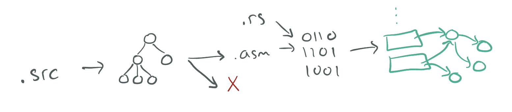

# UCSD CSE 231 (Spring 2026)

## Crew

- [Ranjit Jhala](https://ranjitjhala.github.io) (Instructor)
- Cole Kurashige (TA)
- Vivien Rindisbacher (TA)

(with **many thanks** to [Joe Politz](https://jpolitz.github.io) from whom much of this material is gratefully borrowed!)

[Basics](#basics) -
[Resources](#resources) -
[Assignments](#assignments) -
[Schedule](#schedule) -
[Staff](#staff) -
[Grading](#grading) -
[Policies](#policies)

In this course, we'll explore the implementation of **compilers**: programs that
transform source programs into other useful, executable forms. This will
include understanding syntax and its structure, checking for and representing
errors in programs, writing programs that generate code, and the interaction
of generated code with a runtime system.

We will explore these topics interactively in lecure, you will implement
an increasingly sophisticated series of compilers throughout the course to
learn how different language features are compiled, and you will think
through design challenges based on what you learn from implementation.

This web page serves as the main source of announcements and resources for the
course, as well as the syllabus.

## Basics

- **Lecture:** _CENTER 115_ Tu-Th 12:30-1:50pm
- **Discussion:** _CENTER 115_ Fr 3:00-3:50pm
- **Midterm Exams:** \_
  - **Friday May 1** (Week 5), 3:00-3:50pm
  - **Friday May 29** (Week 9), 3:00-3:50pm
  - **Monday June 8** (finals week), 1:00-2:30pm (CENTER 115)
- **Q&A Forum:** [Piazza](https://piazza.com/ucsd/spring2026/cse231)

## Office Hours

Ranjit Jhala

- Wed 1pm - 2pm in CSE 3110

Cole Kurashige

- 2 PM Wednesday CSE third floor lobby
- 3 PM Friday (alternating with Vivien for section)

Vivien Rindisbacher

- 2 pm Tuesday
- 3 pm Friday (during Section - will do earlier in the week on exam weeks)

## Resources

Textbook/readings: There's no official textbook, but we will link to
different online resources for you to read to supplement lecture. Versions
of this course have been taught at several universities, so sometimes I'll
link to those instructors' materials as well.

Some useful resources are:

- [The Rust Book](https://doc.rust-lang.org/book/) (also [with embedded quizzes](https://rust-book.cs.brown.edu/))
- [An Incremental Approach to Compiler Construction](http://scheme2006.cs.uchicago.edu/11-ghuloum.pdf)
- [UMich EECS483](https://maxsnew.com/teaching/eecs-483-fa22/)
- [Northeastern CS4410](https://courses.ccs.neu.edu/cs4410/)

## Assignments

| **Assignment**                      | **Github Classroom**                            | **Due Date**              |
| :---------------------------------- | :---------------------------------------------- | :------------------------ |
| [01-adder](./week1/index.md)        | [link](https://classroom.github.com/a/v0zY8Ima) | Fri, April 3, 23:59:59    |
| [02-boa](./week2/index.md)          | [link](https://classroom.github.com/a/W9pJ27oc) | Mon, April 13, 23:59:59   |
| [03-cobra](./week3/index.md)        | [link](https://classroom.github.com/a/O-Mv26IZ) | Fri, April 24, 23:59:59   |
| [04-diamondback](./week4/index.md)  | [link](https://classroom.github.com/a/Ns8NQztj) | Fri, May 8, 23:59:59      |
| [05-egg-eater](./week67/index.md)   | [link](https://classroom.github.com/a/Zcs4Nbim) | Mon, May 18, 23:59:59     |
| [06-fer-de-lance](./week8/index.md) | [link](https://classroom.github.com/a/yxcnCqeO) | Mon, May 25, 23:59:59     |
| [07-gardener](./week89/index.md)    | [link](https://classroom.github.com/a/PM4fnr3Y) | Wed, June 3, 23:59:59     |
| [08-indigo](./week10b/index.md)     | [link](https://classroom.github.com/a/90hvqgOf) | Friday, June 12, 23:59:59 |

## Lecture Schedule

The schedule below outlines topics, due dates, and links to assignments. The
schedule of lecture topics might change slightly, but I post a general plan so
you can know roughly where we are headed.

### Week 10 - ANF Normal Forms and Type Inference

**Tue**

- [Notes](./static/handout10a.pdf)
- [Markup](./static/markup10a.pdf)
- [Worksheet](./static/sheet10a.pdf)

**Thu**

- [Notes](./static/handout10b.pdf)
- [Markup](./static/markup10b.pdf)
- [Worksheet](./static/sheet10b.pdf)

### Week 9 - Register Allocation

**Tue**

- [Notes](./static/handout9a.pdf)
- [Markup](./static/markup9a.pdf)
- [Worksheet](./static/sheet9a.pdf)

**Thu**

- [Notes](./static/handout9b.pdf)
- [Markup](./static/markup9b.pdf)
- [Worksheet](./static/sheet9b.pdf)

### Week 8 - Closures (contd.) + Garbage Collection

**Tue**

- [Notes](./static/handout7b.pdf) (contd. from Week7)
- [Notes with code](./static/handout7b-full.pdf)
- [Markup](./static/markup8a.pdf)
- [Worksheet](./static/sheet8a.pdf)
- [Code](https://github.com/ucsd-cse231/sp26-code-new/tree/week8a)
- [Markdown](./static/lec8a.md)

**Thu**

- [Notes](./static/gc.pdf)
- [Markup (same as Week9 Tue)](./static/markup9a.pdf)
- [Worksheet](./static/sheet8b.pdf)

### Week 7 - Closures

**Tue**

- [Notes](./static/handout7a.pdf)
- [Markup](./static/markup7a.pdf)
- [Worksheet](./static/sheet7a.pdf)
- [Code](https://github.com/ucsd-cse231/sp26-code-new/tree/week7a)

**Thu**

- [Notes](./static/handout7b.pdf)
- [Notes with code](./static/handout7b-full.pdf)
- [Markup](./static/markup7b.pdf)
- [Worksheet](./static/sheet7b.pdf)
- [Code](https://github.com/ucsd-cse231/sp26-code-new/tree/week7b)

### Week 6 - Heap Data

**Tue**

- [Notes](./static/handout6a.pdf)
- [Markup](./static/markup6a.pdf)
- [Worksheet](./static/sheet6a.pdf)
- [Code](https://github.com/ucsd-cse231/sp26-code-new/tree/week6a)

**Thu**

- [Notes](./static/handout6b.pdf)
- [Markup](./static/markup6b.pdf)
- [Worksheet](./static/sheet6b.pdf)
- [Code](https://github.com/ucsd-cse231/sp26-code-new/tree/week6b)

**Resources**

- [New/Lerner on Pairs and Tuples](https://maxsnew.com/teaching/eecs-483-fa21/lec_tuples_notes.html)
- [New on Lambdas](https://maxsnew.com/teaching/eecs-483-fa21/lec_lambdas_notes.html)

### Week 5 - Functions and Tail Calls

**Tue**

- [Notes](./static/handout4b.pdf)
- [Markup](./static/markup5a.pdf)
- [Worksheet](./static/sheet5a.pdf)
- [Code](https://github.com/ucsd-cse231/sp26-code-new/tree/week5a)

**Thu**

- [Notes](./static/handout5b.pdf)
- [Markup](./static/markup5b.pdf)
- [Worksheet](./static/sheet5b.pdf)
- [Code](https://github.com/ucsd-cse231/sp26-code-new/tree/week5b)

**Resources**

- [Ben Lerner's Notes on Tail Calls](https://course.ccs.neu.edu/cs4410sp20/lec_tail-calls_stack_notes.html)

### Week 4 - Loops and Printing

**Tue**

- [Notes](./static/handout4a.pdf)
- [Markup](./static/markup4a.pdf)
- [Worksheet](./static/sheet4a.pdf)
- [Code](https://github.com/ucsd-cse231/sp26-code-new/tree/week4a)

**Thu**

- [Notes](./static/handout4b.pdf)
- [Markup](./static/markup4b.pdf)
- [Worksheet](./static/sheet4b.pdf)
- [Code](https://github.com/ucsd-cse231/sp26-code-new/tree/week4b)

### Week 3 - Tags and Blocks

- [Assignment (due Friday, April 24, 11:59pm)](./week3/index.md)

**Thu**

- [Notes](./static/handout3b.pdf)
- [Markup](./static/markup3b.pdf)
- [Worksheet](./static/sheet3b.pdf)
- [Code](https://github.com/ucsd-cse231/sp26-code-new/tree/week3b)

### Week 2 - Let Bindings and Binary Operators

- [Assignment (due Monday, April 13, 11:59pm)](./week2/index.md)

**Tue**

- [Notes](./static/handout2a.pdf)
- [Markup](./static/markup2a.pdf)
- [Worksheet](./static/sheet2a.pdf)
- [Code](https://github.com/ucsd-cse231/sp26-code-new/tree/week2-bin)

**Thu**

- [Notes](./static/handout2b.pdf)
- [Markup](./static/markup2b.pdf)
- [Worksheet](./static/sheet2b.pdf)
- [Code](https://github.com/ucsd-cse231/sp26-code-new/tree/week2-if)

**Resources**

- [Max New on Let and the Stack](https://maxsnew.com/teaching/eecs-483-fa21/lec_let-and-stack_notes.html)
  _Max New and Ben Lerner have done a nice job writing up notes on
  let-bindings and the stack. They don't use exactly the same style
  or make the same decisions as CSE231, but things are close enough
  to be useful._

### Week 1 - Rust and Source to Assembly Conversion

- [Assignment (due Friday, April 3, 23:59:59)](./week1/index.md)

**Tue**

- [Notes](./static/handout1a.pdf)
- [Markup](./static/markup1a.pdf)

**Thu**

- [Notes](./static/handout1b.pdf)
- [Markup](./static/markup1b.pdf)
- [Worksheet](./static/sheet1b.pdf)

**Resources**

- [Rust Book Chapters 1-6](https://doc.rust-lang.org/book)
- [x86-64 quick reference (Stanford)](https://web.stanford.edu/class/archive/cs/cs107/cs107.1196/guide/x86-64.html)
- [x86-64 quick reference (Brown)](https://cs.brown.edu/courses/cs033/docs/guides/x64_cheatsheet.pdf)

## Staff

**Office hours** are concentrated on Wed, Thu, Fri, since most
assignments are due Friday evening. Please check the calendar before you come
in case there have been any changes. When you come to the office hour, we may
ask you to put your name in the queue using the whiteboard. Read the
description about [collaboration below](#policies) for some context about
office hours. The office hours schedule is below; each event has details about
remote/in-person:

## Grading

Your grade will be calculated from **assignments**, **exams** and **worksheets**.

- **(8-9) Assignments [30%]** are given periodically, typically at one or two week intervals.
  ~~On each you'll get a score from 0-3 (Incomplete/No Pass, Low Pass, Pass, High Pass).~~
  We will just use the raw scores in the assignments to avoid any unfairness due to
  rounding.

- **(2/3) Midterm Exams [50%]** There are three exams in the course,
  one in week 5 and one in week 9, given in the Friday discussion sections,
  and one in the finals week. Your top two exams will be counted.

- **(daily) Worksheets [20%]** Every lecture will come with a 1-2 page handout,
  that must be filled in and submitted _at the end of the lecture_.
  Credit is given for reasonable effort in engaging with the notes
  from the day on the handout. Turn in 75% of the worksheets to get full credit.

**Comprehensive Exam**: For graduate students using this course for a
comprehensive exam requirement, you must get "A" achievement on the exams. Note
that you can use the final exam make-up time to do this!

## Policies

### Lectures and Exams

1. We will **not podcast** lectures.
2. We will have **worksheets** to be filled in and submitted at the end of each lecture.
3. We have a **no-screens** policy: students must keep their devices off during lectures.
4. We require all exams be taken on the [announced dates and times](https://ucsd-cse230.github.io/wi26/contact.html)

### Integrity of Scholarship

University rules on integrity of scholarship will be strictly enforced. By
taking this course, you implicitly agree to abide by the UCSD Policy on
Integrity of Scholarship described [here](http://www-senate.ucsd.edu/manual/Appendices/app2.htm).

### Programming Assignments

**Eight** programming assignments, _done individually_.
Will be assigned approximately every two weeks,
and instructions on turning them in will be posted with
each assignment.

### Late Work

You have a total of _six late days_ that you can use throughout the quarter,
but no more than _four late days_ per assignment.

- A late day means anything between 1 second and 23
  hours 59 minutes and 59 seconds past a deadline
- If you submit past the late day limit, you get 0 points for that assignment
- There is no penalty for submitting late but within the limit

### Regrades

Mistakes occur in grading. Once grades are posted for an assignment, we will
allow a short period for you to request a fix (announced along with grade
release). If you don't make a request in the given period, the grade you were
initially given is final.

### Exams

There will be three "midterm exams" during the quarter.
The first two will be held in discussion section, and
the third during the final exam slot.
We will take the **best two of three** scores from the three exams
to calculate your grade. (So, if you score high enough
on the exams during the quarter, you can skip the final.)
You can use one **single sheet of notes (front and back)**
on the exams, but no other study aids.

You cannot discuss the content of exams with others in the course until grades
have been released for that exam.

Some past exams are available at the link below for reference on format
(content changes from offering to offering so this may not be
representative):

- [sample exam 1](static/compilers-sample-exam-1.pdf)
- [sample exam 2](static/compilers-sample-exam-2.pdf)
- [sample exam 3](static/compilers-sample-exam-3.pdf)
- [sample exam 4](static/compilers-sample-exam-4.pdf)
- [x86 reference](static/x86-reference.pdf)
